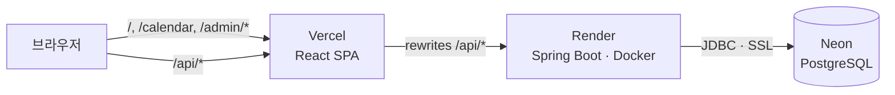
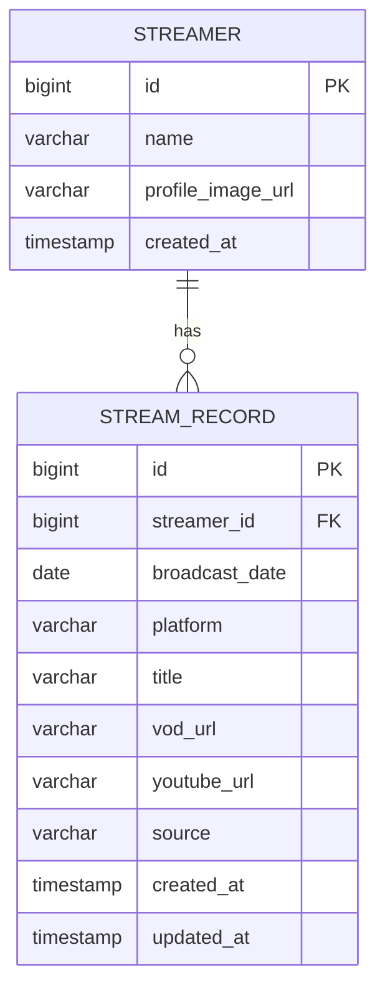

# StreamerCalendar — Backend

좋아하는 스트리머의 지난 방송을 **달력**으로 모아 보고, 각 방송일에 **원본 다시보기**와 **유튜브 편집 영상**을 연결해 두는 서비스의 백엔드(REST API)입니다.
유튜브 영상을 보다가 "이게 언제 방송이었지?"를 캘린더로 바로 역추적하는 것이 목표입니다.

- **서비스**: https://streamer-calendar-web.vercel.app
- **API**: https://streamercalendar.onrender.com/api/streamers
- **프론트엔드 저장소**: https://github.com/johnch94/StreamerCalendar-web

> Render 무료 플랜이라 15분 동안 요청이 없으면 서버가 잠듭니다. 첫 접속은 30~60초 걸릴 수 있어요.


## 기술 스택

| 구분 | 사용 기술 |
| --- | --- |
| Language / Framework | Java 21, Spring Boot 4.1 (Web MVC, Data JPA, Validation, Security) |
| DB | PostgreSQL (운영: Neon) |
| Test | JUnit 5, MockMvc(`@WebMvcTest`), `@DataJpaTest`, Spring Security Test |
| Infra | Docker, Render (API), Vercel (프론트, `/api` 프록시), Neon (DB) |

## 아키텍처



- 브라우저는 **Vercel 도메인만** 호출하고, Vercel이 `/api/*`를 Render로 프록시합니다. 프론트와 API가 같은 도메인이 되므로 세션 쿠키(`SameSite=Lax`)가 그대로 동작하고 CORS 설정이 필요 없습니다.
- 로컬 개발도 Vite proxy로 같은 구조를 씁니다 (`/api` → `localhost:8080`).

## 주요 구현 내용

### 1. 사용자 / 관리자 권한 분리 (Spring Security 세션 인증)

| 대상 | 할 수 있는 것 |
| --- | --- |
| 사용자 (로그인 없음) | 스트리머 · 방송 기록 **조회** (`GET`) |
| 관리자 (`ADMIN`) | 스트리머 · 방송 기록 **등록 · 수정 · 삭제** |

- **기본 거부 방식:** 공개할 조회 경로만 `SecurityConfig`에 명시적으로 열고, 나머지는 모두 관리자 전용입니다. 앞으로 추가될 API(예: 관리자 전용 유튜브 후보 큐 조회)가 실수로 공개되지 않습니다.
- **관리자 계정:** 1명뿐이라 DB 테이블 대신 설정값(`app.admin.*`)으로 관리하고, 비밀번호는 BCrypt 해시로 저장합니다. 값이 없으면 또는 비밀번호에 `{bcrypt}` 접두사가 없으면 서버가 뜨지 않게 해서(`@Validated` + `@NotBlank`) 관리자 없이 조용히 배포되는 일을 막습니다.
- **로그인 처리**
  - JSON 로그인 API(`POST /api/auth/login`)에서 인증 정보를 세션에 직접 저장합니다 (Spring Security 6+의 명시적 저장 방식).
  - 로그인 시 세션 ID를 새로 발급해 세션 고정 공격을 막습니다.
- **로그인 상태 유지:** remember-me 쿠키(14일, SHA-256 서명, `HttpOnly`, `SameSite=Lax`, HTTPS에서 `Secure`). 무료 서버가 재시작돼 세션이 사라져도 다시 로그인하지 않아도 됩니다.
- **필터 단계의 401/403**도 API 공통 에러 포맷으로 응답합니다.

### 2. 공통 에러 응답

모든 에러를 `{ code, message, timestamp }` 형식으로 응답합니다. `GlobalExceptionHandler`가 `ResponseEntityExceptionHandler`를 상속해 Spring MVC 표준 예외를 알맞은 상태 코드로 바꿉니다.

| 상황 | 응답 |
| --- | --- |
| 파라미터 타입 오류, 범위 초과(`month=13`), 깨진 JSON, 형식이 틀린 필드 | `400 INVALID_REQUEST` (필드 이름 포함) |
| 로그인 필요 / 로그인 실패 | `401 UNAUTHORIZED` / `401 INVALID_CREDENTIALS` |
| 관리자 권한 없음 | `403 FORBIDDEN` |
| 리소스 없음 / 없는 경로 | `404 STREAM_NOT_FOUND` 등 / `404 NOT_FOUND` |
| 지원하지 않는 메서드 / Content-Type | `405 METHOD_NOT_ALLOWED` (`Allow` 헤더) / `415 UNSUPPORTED_MEDIA_TYPE` |
| 예상하지 못한 예외 | `500 INTERNAL_SERVER_ERROR` (서버 로그에 스택 트레이스 기록) |

```json
{ "code": "INVALID_REQUEST", "message": "month: 12 이하여야 합니다", "timestamp": "2026-09-28T02:34:40Z" }
```

### 3. N+1 쿼리 개선 (쿼리 수를 테스트로 검증)

`QueryCountTest`에서 Hibernate Statistics로 실제 실행되는 SQL 수를 세어 문제를 먼저 재현한 뒤 고쳤습니다 (스트리머 3명, 방송 기록 6건 기준).

| 작업 | 개선 전 | 개선 후 | 방법 |
| --- | --- | --- | --- |
| 방송 기록 목록 조회 (캘린더) | 4번 (1 + 스트리머 수) | **1번** | `@EntityGraph`로 streamer 함께 조회 |
| 방송 기록 상세 조회 | 2번 | **1번** | `@EntityGraph` |
| 스트리머 삭제 (연관 기록 포함) | 5번 (기록 수에 비례) | **2번** (기록 수와 무관) | cascade로 한 건씩 지우는 대신 JPQL 일괄 DELETE |

### 4. 테스트 (51건)

| 테스트 | 내용 |
| --- | --- |
| `AuthControllerTest` (12) | 로그인 성공·실패·검증, 세션 ID 재발급, 로그아웃, remember-me 발급·위조 쿠키·삭제 |
| `StreamRecordControllerTest` (22) | CRUD, 비로그인 401, 잘못된 요청 400/404/405/415, 예상 못 한 예외 500 |
| `StreamerControllerTest` (8) | CRUD, 비로그인 401, 관리자 아님 403 |
| `QueryCountTest` (4) | 쿼리 수 검증 (위 표), 없는 스트리머 삭제 시 404 |
| `AdminPropertiesTest` (4) | 관리자 비밀번호 설정값 형식 검증 (`{bcrypt}` 접두사 없으면 기동 실패) |
| `StreamercalendarApplicationTests` (1) | 컨텍스트 로딩 |

컨트롤러 테스트는 실제 보안 설정을 슬라이스에 올려(`@ImportSecurityConfig`) 권한 규칙까지 함께 검증합니다.

## API

Base URL `/api` · JSON · 날짜 `YYYY-MM-DD` · 시각 ISO 8601(UTC)

| Method | Path | 권한 | 설명 |
| --- | --- | --- | --- |
| `GET` | `/streamers` | 공개 | 스트리머 목록 |
| `POST` | `/streamers` | 관리자 | 스트리머 등록 `{ name, profileImageUrl? }` |
| `DELETE` | `/streamers/{id}` | 관리자 | 스트리머 삭제 (연관 방송 기록 함께 삭제) |
| `GET` | `/streams?streamerId&platform&year&month` | 공개 | 방송 기록 조회 (캘린더) |
| `GET` | `/streams/{id}` | 공개 | 방송 기록 상세 |
| `POST` | `/streams` | 관리자 | 방송 기록 등록 `{ streamerId, broadcastDate, platform, title, vodUrl?, youtubeUrl? }` |
| `PUT` | `/streams/{id}` | 관리자 | 방송 기록 수정 |
| `DELETE` | `/streams/{id}` | 관리자 | 방송 기록 삭제 |
| `POST` | `/auth/login` | 공개 | 로그인 `{ username, password, rememberMe? }` |
| `POST` | `/auth/logout` | 공개 | 로그아웃 |
| `GET` | `/auth/me` | 공개 | 로그인 상태 `{ authenticated, username }` |

`platform`: `CHZZK` · `SOOP` · `YOUTUBE` · `TWITCH` · `OTHER` / `source`: `MANUAL` · `CRAWLED`(Phase 2)

## ERD



- `STREAM_RECORD.platform`은 방송이 실제로 송출된 플랫폼을 기록 단위로 남깁니다. 한 스트리머가 여러 플랫폼에서 방송할 수 있어서입니다.
- `source`는 수동 입력(`MANUAL`)과 Phase 2의 크롤링 수집(`CRAWLED`)이 함께 쓰일 수 있도록 처음부터 두었습니다.

## 로컬 실행

**준비물:** JDK 21, PostgreSQL

1. DB 생성: `createdb stream_cal`
2. 비밀 설정 파일 만들기 (git에 올라가지 않음)
   ```bash
   cp src/main/resources/application-secret.properties.example src/main/resources/application-secret.properties
   ```
3. `application-secret.properties`에 DB 접속 정보와 관리자 계정 입력
   ```bash
   ./gradlew hashPassword -Ppassword=원하는비밀번호   # app.admin.password에 넣을 {bcrypt} 해시
   openssl rand -base64 32                           # app.admin.remember-me-key
   ```
4. 실행: `./gradlew bootRun` → http://localhost:8080/api/streamers
5. 테스트: `./gradlew test` (`QueryCountTest`와 `contextLoads`는 로컬 PostgreSQL을 사용하고, 끝나면 롤백합니다)

환경변수(`SPRING_DATASOURCE_URL`, `APP_ADMIN_USERNAME` 등)가 있으면 설정 파일보다 우선합니다.

## 배포 (Render)

`Dockerfile`로 이미지를 빌드해 Render(Singapore, Free)에 배포하고, `main`에 푸시하면 자동으로 다시 배포됩니다. 운영 비밀값은 Render 환경변수로만 주입합니다.

| 환경변수 | 설명 |
| --- | --- |
| `SPRING_DATASOURCE_URL` / `_USERNAME` / `_PASSWORD` | Neon 접속 정보 (`jdbc:postgresql://...?sslmode=require`) |
| `APP_ADMIN_USERNAME` / `APP_ADMIN_PASSWORD` / `APP_ADMIN_REMEMBER_ME_KEY` | 관리자 계정 (`{bcrypt}` 해시) · remember-me 서명 키 |
| `SERVER_SERVLET_SESSION_COOKIE_SECURE` | `true` (HTTPS 전용 쿠키) |
| `SPRING_JPA_HIBERNATE_DDL_AUTO` | 첫 배포 `update` → 이후 `validate` |

- Render 무료 플랜 메모리(512MB)에 맞춰 힙 비율을 제한했습니다 (`-XX:MaxRAMPercentage=75`).
- 프록시가 붙이는 `X-Forwarded-Proto`를 신뢰해 HTTPS에서 쿠키에 `Secure`가 붙습니다.
- 컨테이너 로케일을 한국어로 고정해 검증 메시지가 한국어로 나옵니다.

## 로드맵

- [ ] 방송 기록 정렬 · 인덱스, 입력값(URL 길이 등) 검증 보강
- [ ] 로그인 시도 횟수 제한
- [ ] Flyway 마이그레이션, Testcontainers 기반 테스트 · CI
- [ ] **Phase 2**: 유튜브 업로드 영상 후보 큐 (`PENDING → MATCHED | IGNORED`, 관리자가 방송과 수동 매칭), 플랫폼 채널 등록 · 크롤링 연동
